# quake-logo-wall-light

Quake logo as a wall light ornament.
3d printed logo with leds underneath, which glows towards the wall making
nice ambient light, which can be further modified to your needs.

> [!IMPORTANT]
> **PLEASE READ CAREFULLY INSTRUCTIONS BEFORE DOING ANYTHING**
>
> Also reading it again the next day really helps :)
> Moreover reading WLED project documentation provides massive amount of
> extra details.
>
> It is important to read the doc before buying anything.

`...huh over 6h of writing docs...`

> [!CAUTION]
> This is still work in progress (as documentation).
> Some files are missing such as distance pegs and hanging mount point.

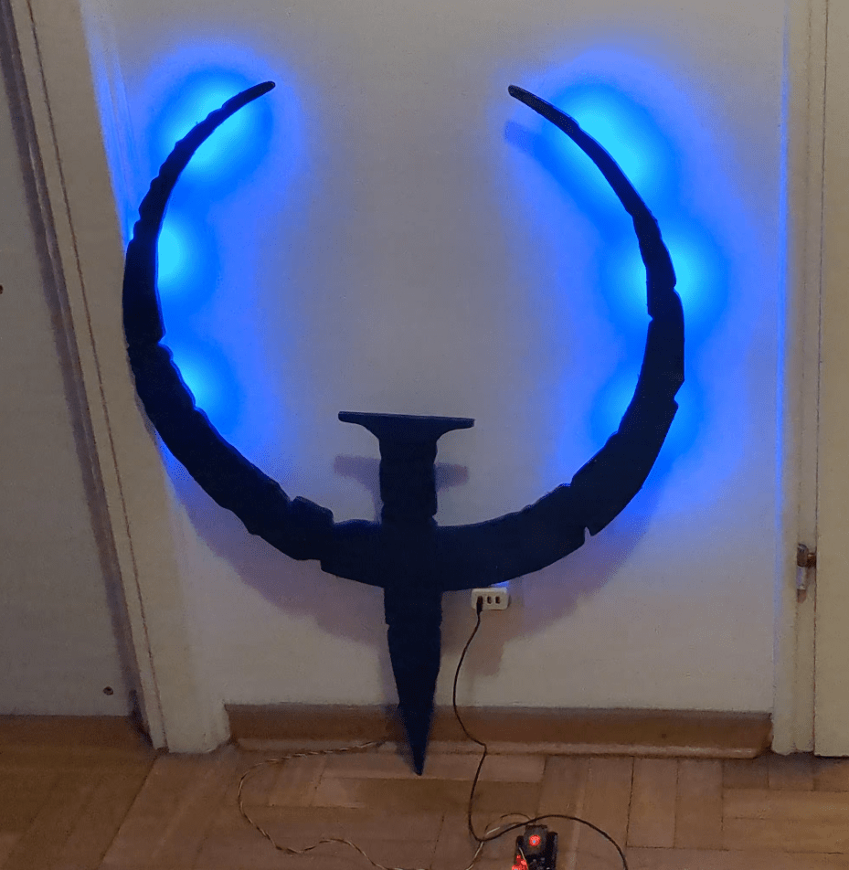

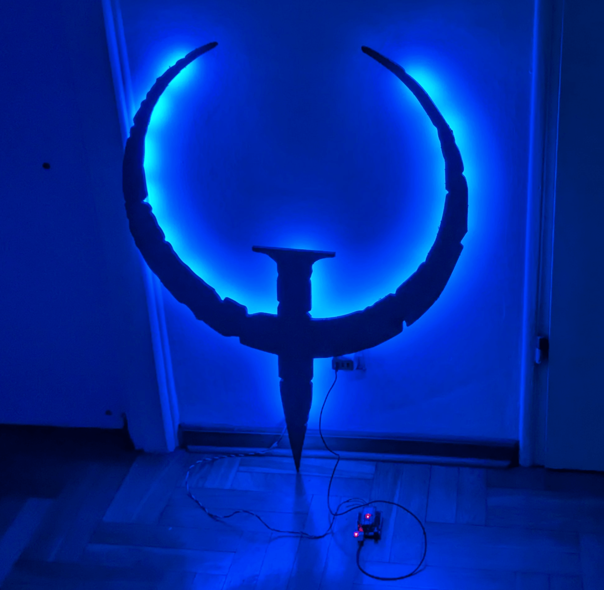


Last picture is copyrighted by [Thunder](https://www.quakeworld.nu/wiki/Thunder)

# Bill of Materials

Generally you need at least 60 USD to make it without post-processing.

## Logo

You can make a logo from 3d print or laser or whatever you like.
Source.

* See [source svg](images/source/quake_logo_black_transparent.svg),
as base vector for the logo.
* See [STL](stl/Quake_Logo.stl) for full STL file for a logo
from above with specific height (10mm).
* For 3d print you probably need to cut it into pieces which can be assembled.
* See [stl/prusa,mini](stl/prusa.mini/) for Prusa Mini specific STL files.
* See [stl/connectors](stl/connectors.stl) for flat connectors to be used
  to glue items together.

## 3D print

* for 3d print - 500g of filament for 3d printer
  (depends on the scale, assuming original 80×90cm),
  so you should be good with one spool of the filament of your choice
  color - whatever you like;

  price: ~ 25 USD

* 20ml universal plastic glue, can be superglue, or 2 part epoxy,
  just double check it is able to glue the logo base you have chosen,
  the best if the glue melts 3d printed plastic.

  optionally you could use hot glue, especially for glueing leds to the logo

  price: ~ 5 USD

## Other cutting methods

* 100×100×3mm wood or other material of your choice
  prince: depends on material, usually you pay for path length of the logo

You can just print logo on the paper and glue it to the material and cut it with
for example wood jigsaw.

Convert SVG to PNG:

```shell
inkscape -w 4096 images/source/quake_logo_black_transparent.svg -o images/source/quake_logo_black_transparent.png
```

Then use PNG as source to print it. To convert a single page to multi-page
document I recommend [posterazor](https://sourceforge.net/projects/posterazor/).

It should be in about 4×4 portrait A4 pages,
so the width is 80cm and heights over 1m.

## Electronic parts

* esp8266 or esp32 device supported by [WLED project](https://kno.wled.ge/basics/compatible-controllers/)
  price: ~ 6 USD

* 5V [100 addressable LEDS](https://kno.wled.ge/basics/compatible-led-strips/)
  in a strip which can be cut with scissors,

  price: ~ 15 USD

  you can use non-addressable leds and simpler on/off switch, will be less
  awesome but cheaper

* 1A 5V USB power adapter or better, usually old power charger for the phone
  is sufficient, the best if it has USB-A port in it.

  price: ~ 3 USD

* USB data cable - to program esp32 when connected to your computer
  price: ~ 2 USD

* 1A USB cable to esp32, about 1m or more, make sure to have plugs compatible
  with the power adapter and the esp32 device

  price: ~ 2 USD

* 1m of 3 or 4 wire AWG 22 copper cables - the best if it is a color ribbon,
  or you could use old USB cable
  or old ethernet cable (internal wires);
  you can use DuPont cables used in breadboards should be ok for,
  low brightness but they are limited in the current.

  The best if the cable has different color per wire, it will be used to
  power the strips and send control signal.
  Choose the3 or 4 wires depend on your LED strip.

* optional - 4x 5 slot WAGO 222 Series Lever-Nuts® or 243 Series MICRO PUSHWIRE®
  or similar connectors if you don't want to solder too much

## Other

* computer + web browser to program esp32
* eye protection goggles
* gloves
* red and black permanent markers
* scissors to cut the led strip
* soldering iron + solder + basic soldering skills
* side cutters to cut the cables
* good cable insulation stripping tool
* sanding paper, P80 up to P120 is recommended

  price: ~ 2 USD

For a wall mount:

* 1x M5x50 wall screw or something similar, depends on logo weight
* 1x dowel for the screw above
* wall drill + drill (duuh)

## Optional for postprocessing

* filler paste for painting, 20g
* spray paint for color overlays
* spray paint transparent glossy or matte for finish
* face mask with filters for spray painting
  or paint on well ventilated area

Make sure to get a quickly drying spray paint, otherwise post processing
will take days and not few hours.

# Time needed

* 27h for 3d Print on Prusa Mini, but this depends on your printer profile etc
* 1h of soldering of cables and LED strips
* 1h uploading WLED firmware to the esp32 from scratch
* post-processing - depends on what you want

Total: Plan about 1h per day over a week

# Preparing the logo

## 3D printing

* print the parts, 5% infill should be enough, just use 4 perimeters if you need
  better postprocessing
* print the glue pads
* print connector set
* print 3 x distance pins
* print hanging mount point
* TODO: add distance pegs models
* TODO: add hanging mount point
* TODO: check best wall mount distance, now it is 1 cm or something

> [!Tip]
> During print of the 3d elements on the 3D printer it is a great time to
> do electronics, see below.

## Generic cutting

Cut the logo on the cutter such as laser, plasma, water or whatever.
Make sure to protect it from all sides from corrosion.

## Logo assembly

Below assumes you have printed the parts on 3d printer.
Sanding elements is needed to make sure glue sticks better.

* place all parts on the flat surface upside down, such as table
* use sand paper to matte fragments on the flat surface of the logos (about 2x2cm)
* place adjacent items close together
* from the connectors set - choose one which suits best for the given dimensions
* use sand paper to matte one side of the connector
* place the connector on the adjacent elements - if it is small enough then it fits
* use sand paper to matte to matte the side of the connector
* apply a bit of glue on the matted fragments of the items and the matted side
  of the connector
* press glued side of the connector to the matted glued side of the items
* apply the force on the connector against the items so it will bins,
  you can just place a paper sheet over it and a glass with cold water

  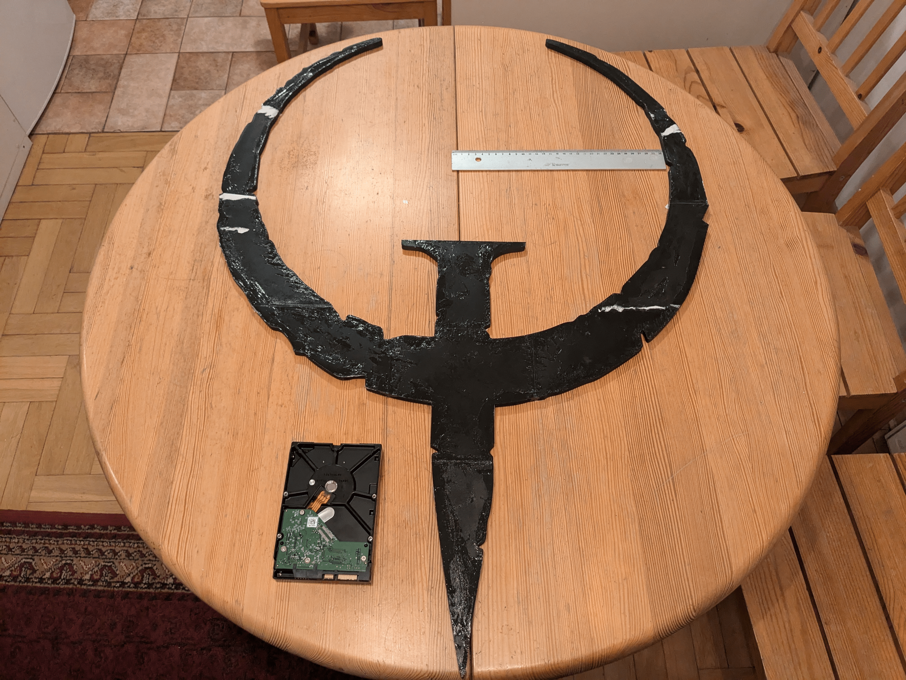
  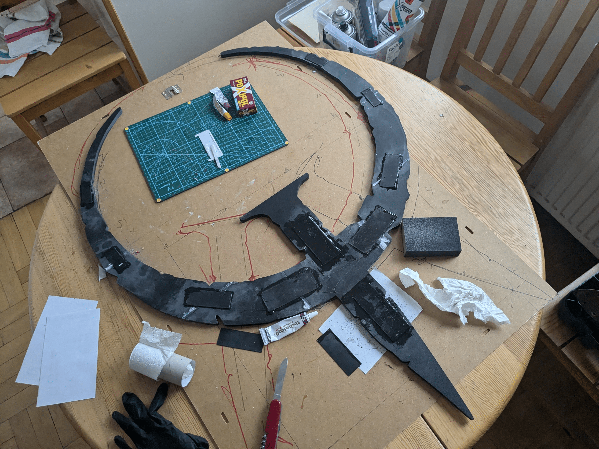

* wait about 1h till the glue binds items together (depends on the glue)
* repeat until you have the full logo set

* on the end of the thin Q elements and the bottom of the extension
  of the Q letter attach distance pegs 2 on the top sides, 1 on the bottom,
  so that logo can rest against the wall on in three points
* at the center of the Q element attach hanging mount point,
  make sure this one is well attached,
  or drill through hole to attach it to the wall

As a result you should have a fully assembled quake logo.

## Post-processing

After assembly you can do additional post processing of the logo, such as:

* sand it
* covering it with fillers for texture effects

  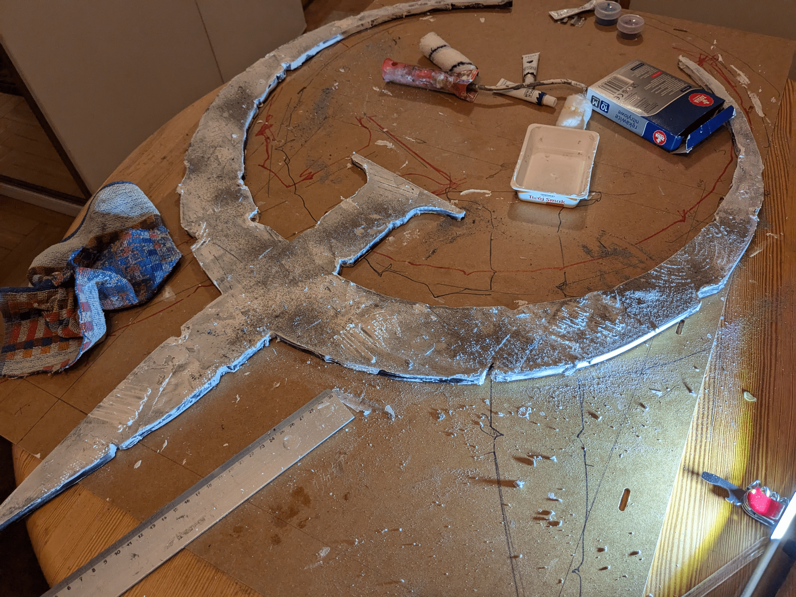

* painting - paint it for example two times,
  the best to be done in the morning and in the evening so you have 8h between
  painting layers

* cover with transparent spray for glossy/matte finish and protection
  and easier dust cleaning in the future

  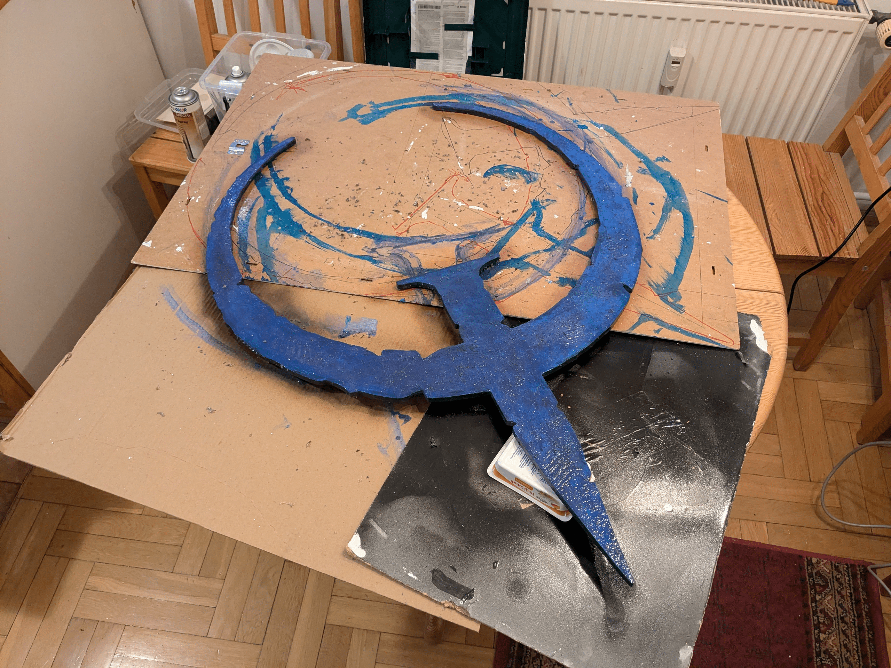

As a result you should have a fully assembled quake logo, which is ready to
have electronics attached to it.

# Electronics

## Basic setup

* look for your 2.4GHz Wifi credentials (SSID and password)
* double check your LED strip parameters, and cable direction
* follow [WLED installation docs](https://kno.wled.ge/basics/getting-started/)

* connect the strip to the cable going from power adapter, check if leds glow.
* make sure your WLED device works without led strip
* connect strip to the esp device so it can be controlled with WLED

## Attaching leds to the logo

Logo light consists of 4 led strips connected in the central point.
Those strips are later cut into smaller pieces, but in certain situations and
assembly it could be preserved as longer uncut parts, you may just need to adjust
the number of leds and the light effect you want to get.

* cut strip into 10 led parts (or about 5cm parts), make sure to mark directions
  of the led strips and where is power and ground and colors per strip

* place the led strips as on the image below, glue them to the logo

  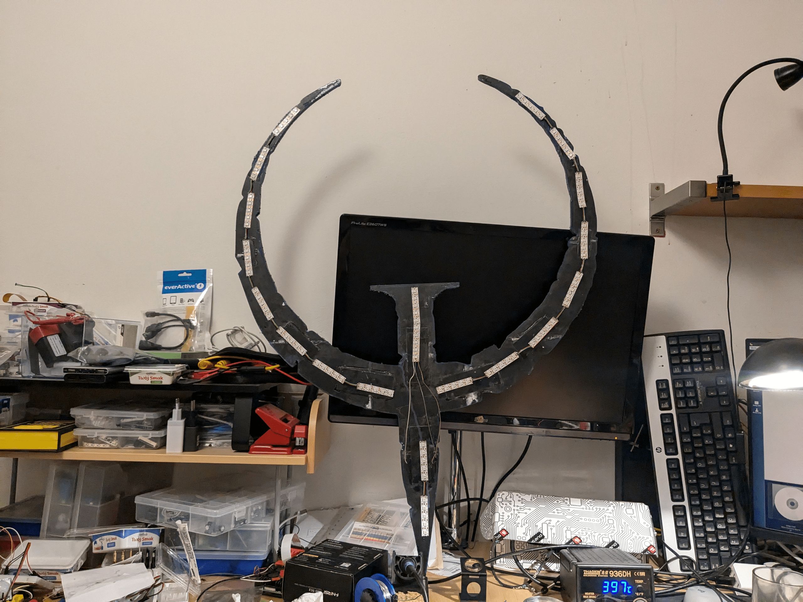

* **THE HARD PART** time to cut the wires and join those strips,
  that will be a lot of cable stripping and soldering

* you need to solder 4 separate chains, two long for left and right part of the
  logo, and two short ones of the vertical part

* notice that the strip ends in the center are aligned in such way that
  each strip direction is outward from the center

* for each central strip guide one wire and solder it with the others, and use
  one shared cable to be used later.
  In here those WAGO connectors will be very handy.

  TODO: add cabling diagram

  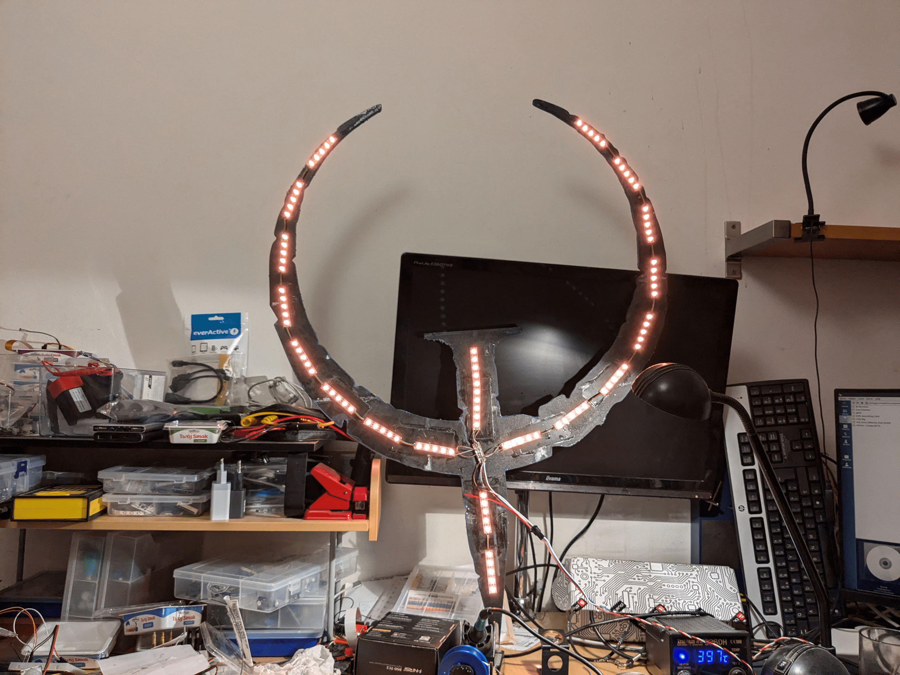

  Notice this is directly connected to the power adapter.

* If above works, then connect the cables from the common connectors to
  the VCC, GND and signal from ESP

  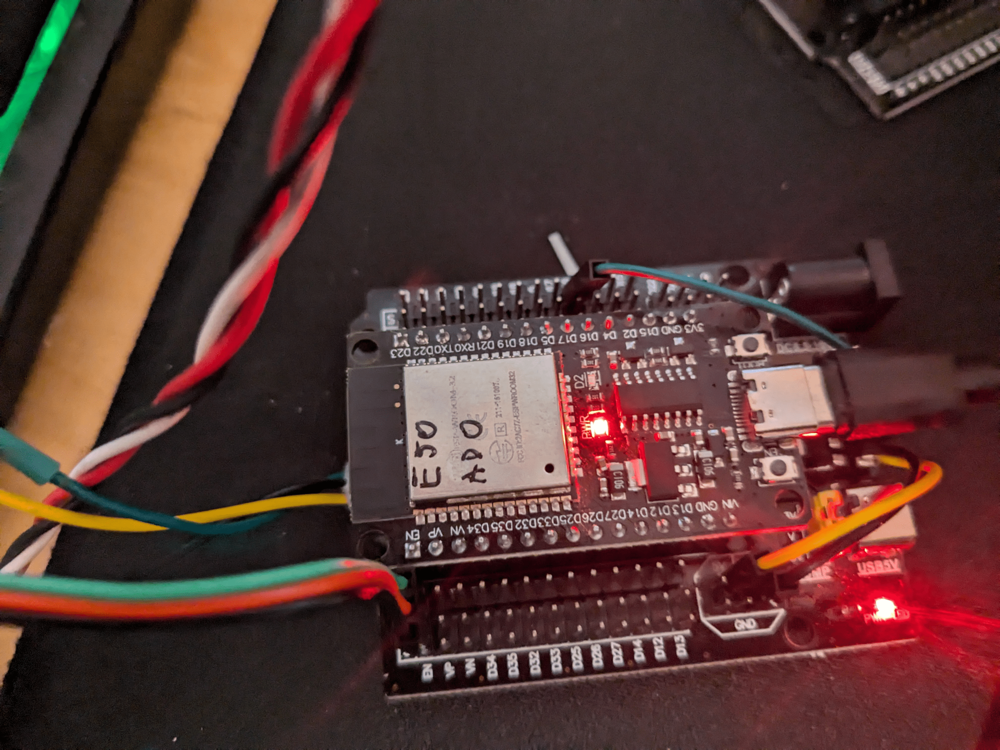

* test if the led strip work, basic animation should flow
  outwards from the center to the logo sharp edges

  

## Final assembly

Transfer logo with leds to the target location and attach it to the wall.

In WLED settings, set led limit to 30, maximum power draw 0.7A.
Then export the config and start to play with the effects.

TODO: add saved wled config/presets... i think I have it somewhere...

Enjoy.

  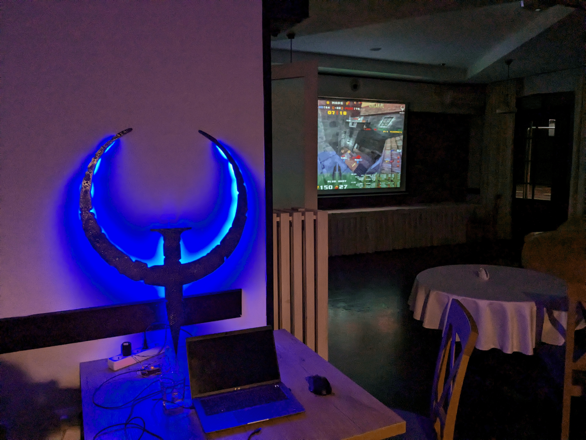

  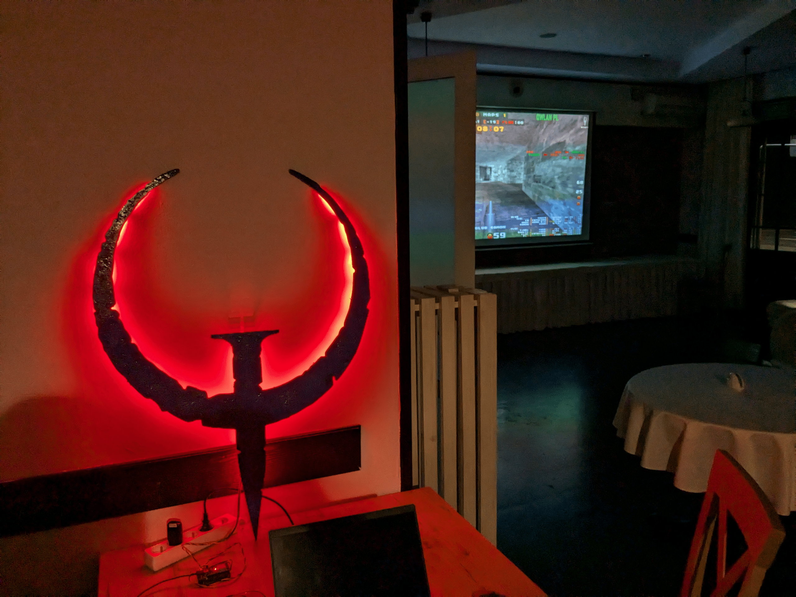

  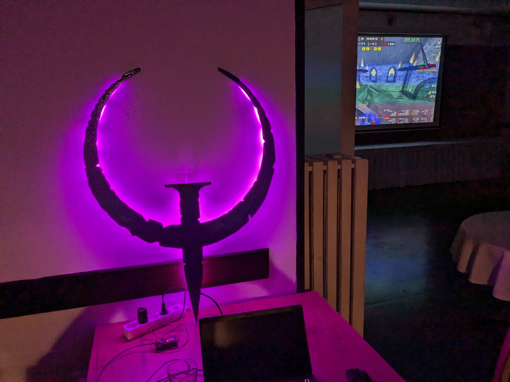
